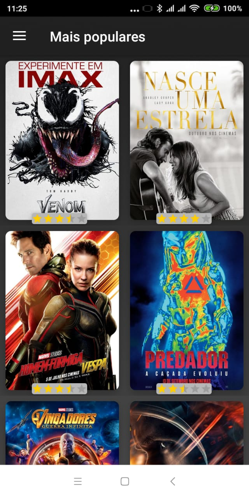
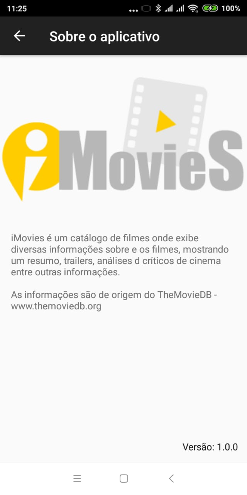

# iMovies

iMovies é um catálogo de filmes onde exibe diversas informações sobre e os filmes, mostrando um resumo, trailers, análises dos críticos de cinema entre outras informações.

As informações são de origem do "TheMovieDB - www.themoviedb.org"

# Configuration

Para buscar filmes famosos, será usada a API do themoviedb.org.
Se ainda não possuir uma conta, você precisará [criar uma](https://www.themoviedb.org/?_dc=1539792338) , a fim de solicitar uma chave de API.

De posse da API_KEY e só informar a mesma aqui no arquivo de properties do gradle [aqui](https://github.com/lnfjunior/iMovies/blob/760b24b78599e5ea9bd2301604ba0f7d12b59dca/gradle.properties#L16).

# Prints

# License

MIT License

Copyright (c) 2018 Luiz Nogueira

Permission is hereby granted, free of charge, to any person obtaining a copy
of this software and associated documentation files (the "Software"), to deal
in the Software without restriction, including without limitation the rights
to use, copy, modify, merge, publish, distribute, sublicense, and/or sell
copies of the Software, and to permit persons to whom the Software is
furnished to do so, subject to the following conditions:

The above copyright notice and this permission notice shall be included in all
copies or substantial portions of the Software.

THE SOFTWARE IS PROVIDED "AS IS", WITHOUT WARRANTY OF ANY KIND, EXPRESS OR
IMPLIED, INCLUDING BUT NOT LIMITED TO THE WARRANTIES OF MERCHANTABILITY,
FITNESS FOR A PARTICULAR PURPOSE AND NONINFRINGEMENT. IN NO EVENT SHALL THE
AUTHORS OR COPYRIGHT HOLDERS BE LIABLE FOR ANY CLAIM, DAMAGES OR OTHER
LIABILITY, WHETHER IN AN ACTION OF CONTRACT, TORT OR OTHERWISE, ARISING FROM,
OUT OF OR IN CONNECTION WITH THE SOFTWARE OR THE USE OR OTHER DEALINGS IN THE
SOFTWARE.
